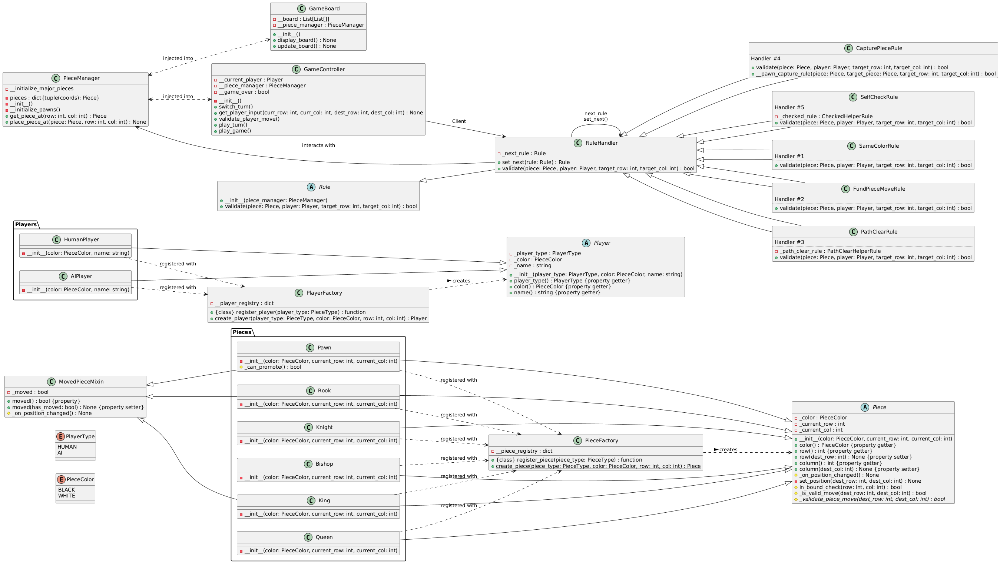

# ChessLite
**ChessLite** is a modular and scalable chess engine built with clean, maintainable code adhering to SOLID principles and design patterns. This project is currently focused on building out the backend logic for a full-featured chess game, with future plans to add a frontend interface and cloud deployment.

## Class Diagram - Backend


[This diagram represents the core architecture of the project's chess engine. The design adheres to SOLID principles.]

## Features

-   **Object-Oriented Design**: Each chess piece is represented as an individual class, inheriting common functionality from the `Piece` base class.
-   **Chain of Responsibility Pattern**: Used to validate moves by chaining various rules like checking for valid piece movement, path clearance, and self-check scenarios.
-   **Factory Pattern**: The `PieceFactory` and `PlayerFactory` are used to dynamically create chess pieces and players, promoting flexibility and clean code.
-   **SOLID Principles**: The project is structured with a strong emphasis on the SOLID principles:
    -   **Single Responsibility Principle**: Each class is responsible for a single part of the chess logic. For example, `PieceManager` handles piece management, `GameController` handles game flow, and each rule class has a specific validation task.
    -   **Open/Closed Principle**: The rule validation system is open for extension by adding new rules but closed for modification of existing rules.
    -   **Liskov Substitution Principle**: Derived piece classes like `Pawn`, `Knight`, and `Bishop` can replace the base `Piece` class without affecting the correctness of the game logic.
    -   **Interface Segregation Principle**: Abstract classes like `Rule` and `Player` ensure that only necessary methods are exposed to the rest of the application.
    -   **Dependency Inversion Principle**: The `GameController` depends on abstractions (`Rule`, `Player`, `PieceManager`), making the system modular and testable.

## Design Patterns

-   **Factory Pattern**: The `PieceFactory` and `PlayerFactory` allow for the flexible and modular creation of chess pieces and players.
-   **Chain of Responsibility**: Move validation is handled through a chain of rules, ensuring that each rule (e.g., `SameColorRule`, `PathClearRule`, `SelfCheckRule`) is responsible for a specific validation task.
-   **Mixin Pattern**: The `MovedPieceMixin` ensures proper tracking of piece state for pieces like pawns and rooks, enabling easy extension to other pieces requiring move state.
---

### Dependencies
```
python = "^3.12"
poetry = "^1.8.3"
```

### Installation
```
# Clone the repository
git clone https://github.com/yourusername/ChessLite.git

# Navigate into the directory
cd ChessLite

# Install the required dependencies using Poetry
poetry install

# Run the game
poetry run python -m src.main
```

### Linting and Testing
```
# Linting using pycodestyle
make lint

# Testing using pytest
make test

# Gather coverage report
make coverage
```